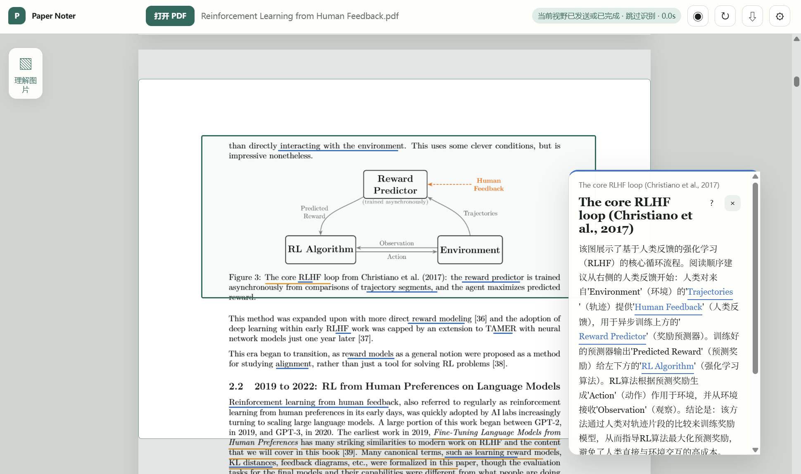
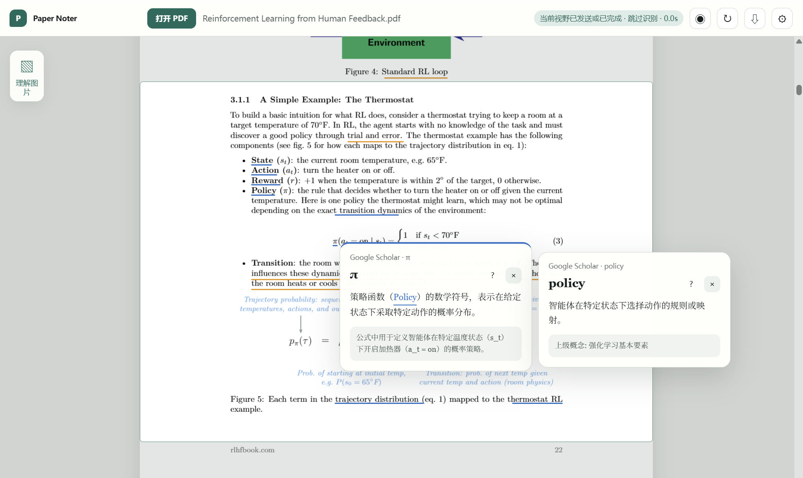
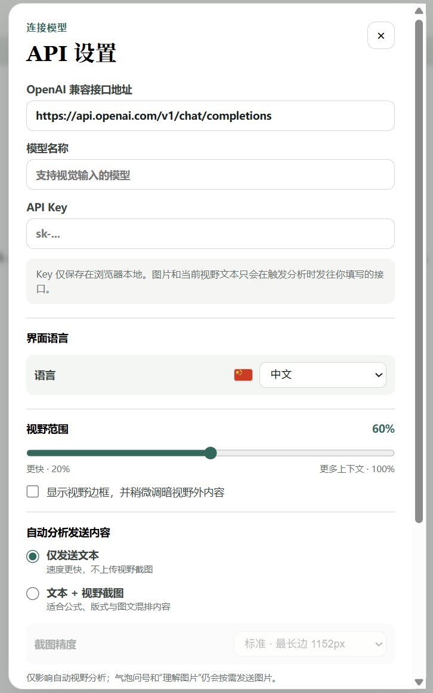
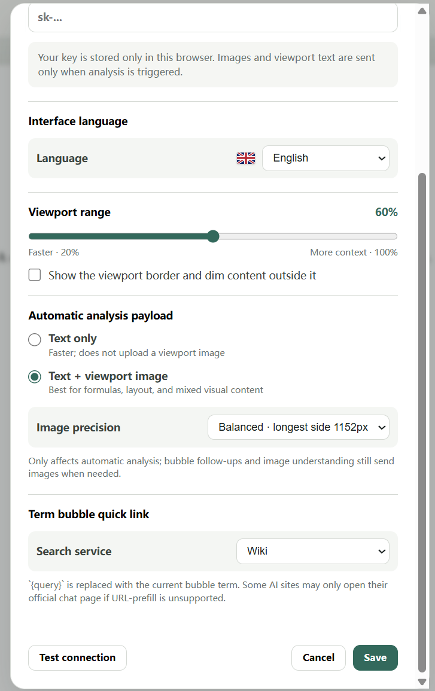

# Paper Noter

出于自身需求设计了本项目。用于快速阅读繁杂pdf的轻量化浏览器插件，接入api直接在pdf上划出重点与名词解释，随pdf长期保存，支持连续追问。

项目开源，欢迎一起改进 ：）

I designed this project based on my own needs. It is a lightweight browser plugin for quickly reading complex PDFs. It integrates with an API to directly highlight key points and provide explanations for terms on the PDF, which can be saved along with the PDF. It also supports continuous questioning.

The project is open source, and we welcome improvements together :)

[中文](#中文) · [English](#english) · [v0.7.7 Release](https://github.com/osiaex/paper-noter/releases/tag/v0.7.7)

## Poster / 产品展示

<p align="center">
  
</p>

<p align="center">
  
</p>

<table>
  <tr>
    <td width="50%"></td>
    <td width="50%"></td>
  </tr>
</table>

## 中文

Paper Noter 是一个 Chrome / Edge Manifest V3 学术 PDF 阅读扩展。它只分析屏幕中央的当前视野，用两种不遮挡正文的下划线标出**名词**与**重点**，并为每篇 PDF 保存独立的本地 JSONL memory。

### 主要功能

- 直接接管网页 PDF；本地 PDF 可在允许文件网址访问后直接打开。
- 自动分析当前视野，支持“仅文本”与“文本 + 截图”模式。
- 滚动停止 500 ms 后识别新区域，并通过覆盖区间避免重复请求。
- 名词和重点可以重叠；点击重叠位置时可选择需要打开的标注。
- 名词气泡支持嵌套解释、公式渲染、深度追问与快速搜索链接。
- 鼠标选中文本后可立即运行 noting，包括 PDF 正文与气泡文本。
- “理解图片”会立即截取当前视野并作为独立并行任务处理。
- 每篇 PDF 的标注、解释、追问和图片理解结果均保存在浏览器本地。
- 可一键显示或隐藏当前 PDF 的全部注释，并可直接复制论文标题。
- 中文 / English 界面、可调视野高度、截图精度与可选视野边框。

### 下载

前往 [GitHub Releases](https://github.com/osiaex/paper-noter/releases) 下载 `paper-noter-v0.7.7-full.zip`。发布包包含完整 CMap、标准字体回退、WASM 与 ICC 资源，以保证中日韩论文、特殊字体和复杂 PDF 的兼容性。

### 安装

Chrome 不允许从 GitHub 静默安装未上架扩展，因此 GitHub 版本需要进行一次手动加载：

1. 下载并解压 ZIP。
2. 打开 `chrome://extensions`，开启右上角的“开发者模式”。
3. 点击“加载已解压的扩展程序”，选择刚刚解压的文件夹。
4. 若要直接打开本地 PDF，在扩展详情中启用“允许访问文件网址”。

真正的一键安装需要后续发布到 Chrome Web Store。不要直接打开 ZIP 内的 `viewer.html`；它必须作为扩展加载。

### API 与隐私

在阅读器右上角打开设置，填写 OpenAI Chat Completions 兼容接口、模型名称和 API Key。Key 保存在 `chrome.storage.local`；只有触发分析时，当前视野文本、按设置生成的截图以及展开气泡上下文才会发送到用户配置的接口。

运行时数据保存在浏览器 OPFS：

```text
paper-memory/<pdf_sha256>/
  meta.json
  memory.jsonl
  coverage.json
  assets/*.webp
```

卸载扩展或清除扩展数据可能删除本地 memory。请通过工具栏的 ⇩ 导出按钮备份；在另一台设备打开同一份 PDF 后，点击 ⇧ 即可导入。新版 JSONL 首行包含 PDF SHA-256、文本指纹和布局指纹。插件仅在文件哈希或布局指纹一致时自动复用带坐标的标注；纯文本指纹不会自动绑定旧坐标。身份计算最多抽样 5 页，失败时不会阻止 PDF 正常打开；旧版 JSONL 仍可在确认后导入。

### 从源码构建

```powershell
npm.cmd install
npm.cmd run check
npm.cmd run build
```

可加载的完整扩展位于 `dist/`。生成发布包：

```powershell
npm.cmd run release
```

ZIP 与 SHA-256 校验和会生成在 `release/`。

### 开源说明

Paper Noter 采用 [MIT License](LICENSE) 开源，欢迎用于个人学习、教学、学术研究和非商业项目。MIT 同时允许商业使用、修改与再分发，但必须保留版权和许可声明。项目按“原样”提供，不附带任何明示或暗示担保。

PDF.js 与 KaTeX 的许可证见 [THIRD_PARTY_NOTICES.md](THIRD_PARTY_NOTICES.md)。

---

## English

Paper Noter is a Chrome / Edge Manifest V3 extension for reading academic PDFs. It analyzes only the current central viewport, marks **terms** and **key points** with two unobtrusive underline styles, and keeps a separate local JSONL memory for every PDF.

### Highlights

- Opens web PDFs directly and supports local PDFs with file-URL access enabled.
- Analyzes the current viewport in text-only or text-plus-image mode.
- Waits 500 ms after scrolling and tracks covered intervals to avoid duplicate requests.
- Supports overlapping term and key-point annotations with an annotation chooser.
- Provides nested concept bubbles, math rendering, saved follow-ups, and configurable quick links.
- Runs noting on selected text in both the PDF and explanation bubbles.
- Captures the current viewport immediately for parallel image-understanding tasks.
- Stores annotations, explanations, follow-ups, and image results locally per PDF.
- Shows or hides all annotations in one click and copies the paper title directly from the toolbar.
- Includes Chinese / English UI, adjustable viewport height, image precision, and an optional focus border.

### Download

Download `paper-noter-v0.7.7-full.zip` from [GitHub Releases](https://github.com/osiaex/paper-noter/releases). The package includes complete CMaps, standard-font fallbacks, WASM, and ICC resources for reliable rendering of CJK papers, unusual fonts, and complex PDFs.

### Install

Chrome does not allow silent installation of an unpacked extension from GitHub. One manual load is required:

1. Download and extract the ZIP.
2. Open `chrome://extensions` and enable **Developer mode**.
3. Click **Load unpacked** and select the extracted folder.
4. To open local PDFs directly, enable **Allow access to file URLs** in the extension details.

A true one-click installation requires a future Chrome Web Store listing. Do not open `viewer.html` directly; load the folder as an extension.

### API and privacy

Open Settings in the top-right corner and enter an OpenAI Chat Completions-compatible endpoint, model name, and API key. The key stays in `chrome.storage.local`. Viewport text, optional screenshots, and expanded bubble context are sent only when an analysis task is triggered.

Per-paper data is stored locally in browser OPFS:

```text
paper-memory/<pdf_sha256>/
  meta.json
  memory.jsonl
  coverage.json
  assets/*.webp
```

Uninstalling the extension or clearing its data may remove local memory. Use ⇩ in the toolbar to export it, then open the same PDF on another device and click ⇧ to import. New JSONL exports carry the PDF SHA-256 plus text and layout fingerprints. Coordinate-bearing annotations are reused automatically only when the exact file or its layout fingerprint matches; a text-only match never binds old coordinates automatically. Identity calculation samples at most five pages and cannot block normal PDF opening. Legacy JSONL files can still be imported after confirmation.

### Build from source

```powershell
npm.cmd install
npm.cmd run check
npm.cmd run build
```

The unpacked build is generated in `dist/`. To build the release archive:

```powershell
npm.cmd run release
```

ZIP files and SHA-256 checksums are generated in `release/`.

### Open-source statement

Paper Noter is released under the [MIT License](LICENSE). Personal learning, teaching, academic research, and non-commercial projects are especially welcome. MIT also permits commercial use, modification, and redistribution when the copyright and license notice are retained. The software is provided “as is”, without warranty.

See [THIRD_PARTY_NOTICES.md](THIRD_PARTY_NOTICES.md) for PDF.js and KaTeX licensing information.
